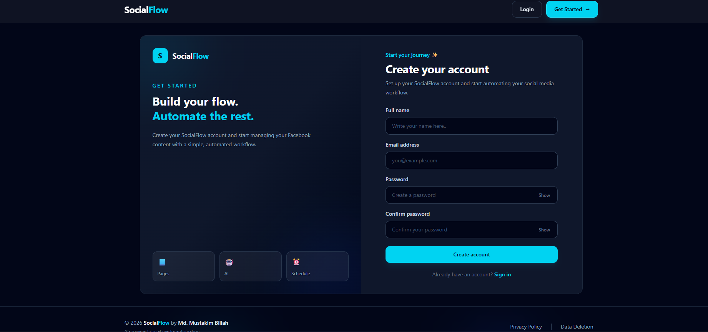
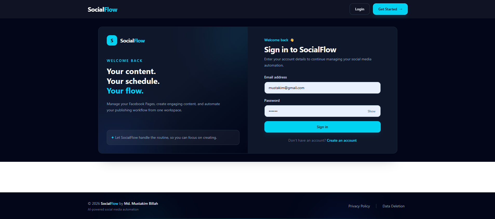
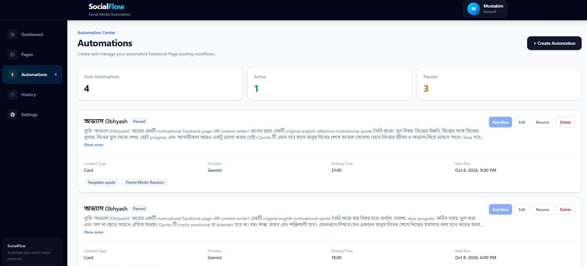

# 🚀 SocialFlow — Frontend

SocialFlow is an AI-powered social media automation platform that helps users create and schedule content for their Facebook Pages.

This repository contains the **frontend application** of SocialFlow, built with React and designed to provide a simple interface for authentication, Facebook Page connection, automation management, and scheduled content publishing.

---

## 🌐 Live Demo

**Live Application:**  
https://social-media-automation-frontend-taupe.vercel.app/

---

## 📂 Related Repositories

### Frontend

https://github.com/mustakim6/social-media-automation-frontend

### Backend

https://github.com/mustakim6/social-media-automation-backend

---

# 📌 Project Overview

SocialFlow allows users to automate Facebook Page content creation and publishing.

Instead of manually creating and publishing every post, users can configure an automation by providing:

```text
Facebook Page
+
Content Prompt
+
Content Type
+
Posting Time
+
Timezone
```

The frontend provides the interface for configuring these automations, while the backend handles AI generation, scheduling, Facebook API communication, and publishing.

---

# ✨ Key Features

- 🔐 User registration and login
- 🔒 Protected application routes
- 🍪 Cookie-based authentication
- 🔗 Facebook account connection
- 📄 Facebook Page selection
- ⚙️ Automation creation and management
- ⏰ Scheduled posting configuration
- 🤖 AI-powered content generation through the backend
- 📝 Multiple content types
- 🎨 Visual card content support
- 🔄 Automation status management
- 📊 Automation information display
- ❌ Facebook Page disconnection
- 📱 Responsive UI
- 🎨 Tailwind CSS-based interface
- ⚡ Axios API integration

---

# 🛠️ Tech Stack

### Core

- **React**
- **JavaScript**
- **Vite**

### Styling

- **Tailwind CSS**
- **DaisyUI**

### Routing

- **React Router**

### API Communication

- **Axios**

### Authentication

- Cookie-based authentication handled by the backend

### Deployment

- **Vercel**

---

# 🏗️ Frontend Architecture

The frontend follows a component-based React architecture.

```text
User
 │
 ▼
React UI
 │
 ├── Authentication
 │
 ├── Facebook Connection
 │
 ├── Page Selection
 │
 └── Automation Management
 │
 ▼
Axios
 │
 ▼
Backend REST API
 │
 ▼
Business Logic
```

The frontend is responsible primarily for presentation and user interaction.

Business-critical operations such as AI generation, Facebook publishing, scheduling, and database operations are handled by the backend.

---

# 📁 Project Structure

The frontend follows a modular structure similar to:

```text
frontend/
│
├── public/
│
├── src/
│   │
│   ├── assets/
│   │
│   ├── components/
│   │
│   ├── pages/
│   │
│   ├── routes/
│   │
│   ├── services/
│   │
│   ├── hooks/
│   │
│   ├── context/
│   │
│   ├── App.jsx
│   ├── main.jsx
│   └── ...
│
├── .env
├── package.json
├── vite.config.js
└── README.md
```

> The exact folder structure may evolve as the project continues to grow.

---

# 🔐 Authentication Flow

SocialFlow uses backend-managed authentication with an HTTP-only JWT cookie.

The frontend does not need to directly manage the JWT token.

### Login Flow

```text
Login Form
    │
    ▼
Axios Request
    │
    ▼
Backend
    │
    ▼
JWT Cookie
    │
    ▼
Authenticated User
```

The frontend sends requests with credentials enabled so that the browser can include the authentication cookie.

Conceptually:

```js
withCredentials: true
```

This allows the frontend and backend to work together using cookie-based authentication.

---

# 📝 Registration & Login

Users can create an account and log in through the authentication interface.

Typical flow:

```text
Register
   ↓
Create Account
   ↓
Login
   ↓
Authenticated Session
   ↓
Dashboard
```

If authentication fails, the frontend displays an appropriate error message to the user.

---

# 🛡️ Protected Routes

Authenticated application pages are protected from unauthenticated access.

Conceptually:

```text
User
 │
 ▼
Check Authentication
 │
 ├── Not authenticated
 │       ↓
 │     Login
 │
 └── Authenticated
         ↓
      Dashboard
```

This prevents users from directly accessing authenticated application areas without a valid session.

---

# 📘 Facebook Connection

One of the main features of SocialFlow is connecting a user's Facebook account.

The frontend starts the Facebook OAuth flow through the backend.

The user selects:

```text
Connect Facebook
        ↓
Facebook Login
        ↓
Facebook Authorization
        ↓
SocialFlow Callback
        ↓
Available Facebook Pages
```

The frontend then allows the user to select the Facebook Page they want to connect.

---

# 📄 Facebook Page Selection

After Facebook authorization, users may have access to multiple Facebook Pages.

SocialFlow presents the available Pages so the user can choose which Page to connect.

Example:

```text
Available Pages

┌──────────────────────────────┐
│ Page A                       │
│ Connect                      │
└──────────────────────────────┘

┌──────────────────────────────┐
│ Page B                       │
│ Connect                      │
└──────────────────────────────┘
```

Once a Page is selected, the frontend sends the selection to the backend.

The backend stores the connected Page and its required Facebook credentials securely.

---

# ⚙️ Automation Management

The frontend provides an interface for creating and managing automations.

A typical automation configuration includes:

```text
Facebook Page
Prompt
Content Type
AI Provider
Posting Time
Timezone
```

Example:

```text
Page:
My Motivation Page

Prompt:
Create a motivational morning post.

Content Type:
Text Only

AI Provider:
Gemini

Posting Time:
08:00 PM

Timezone:
Asia/Dhaka
```

The frontend sends this configuration to the backend.

---

# 🤖 AI Content Generation

The frontend does not directly generate AI content.

Instead:

```text
Frontend
   │
   │ Prompt
   ▼
Backend
   │
   ▼
Gemini
   │
   ▼
Generated Content
   │
   ▼
Backend
   │
   ▼
Facebook
```

This architecture keeps AI API credentials on the server rather than exposing them to the browser.

---

# 📝 Content Types

The frontend supports configuration for different content types.

## Text Only

Generates and publishes a text-based Facebook post.

```text
Prompt
 ↓
AI-generated text
 ↓
Facebook Page
```

---

## Card

Creates a visual card-style post.

The backend handles the actual card generation and Facebook publishing.

The frontend is responsible for allowing the user to configure the automation.

---

## Text + Image

The frontend can configure the text + image automation option.

However, the backend implementation for complete AI image storage and Facebook publishing is still under development.

Therefore, this should currently be considered a partially implemented feature.

---

# ⏰ Scheduling

Users can configure the time and timezone for their automation.

For example:

```text
Posting Time: 08:00 PM
Timezone: Asia/Dhaka
```

The frontend sends this information to the backend.

The backend calculates the actual execution time and handles scheduling.

```text
Frontend
   │
   ▼
postingTime + timezone
   │
   ▼
Backend
   │
   ▼
Scheduler
   │
   ▼
Facebook Post
```

The browser does **not** perform the scheduled publishing.

---

# 📊 Automation Dashboard

The dashboard allows users to view their configured automations.

An automation can contain information such as:

- Facebook Page
- Prompt
- Content type
- Posting time
- Timezone
- Active/inactive status
- Last execution
- Next execution
- Error information

This gives users visibility into their automated content workflow.

---

# 🔄 Automation Status

Users can manage whether an automation is active.

Conceptually:

```text
Active
  │
  ▼
Backend Scheduler
  │
  ▼
Execute Automation
```

If an automation is disabled:

```text
Inactive
  │
  ▼
Scheduler ignores it
```

---

# ❌ Facebook Page Management

Users can manage connected Facebook Pages from the application.

The frontend can display connected Pages and provide actions such as:

- View connected Page
- Disconnect Page
- Connect another Page

The actual Page deletion/deactivation logic is handled by the backend.

---

# 🔌 API Integration

The frontend communicates with the backend through REST APIs.

Axios is used as the HTTP client.

The API base URL is configured using a Vite environment variable.

Example:

```env
VITE_API_URL=http://localhost:5000/api
```

In production:

```env
VITE_API_URL=https://social-media-automation-backend-nngc.onrender.com/api
```

---

# 🌍 Environment Variables

Create a `.env` file in the frontend project.

Example:

```env
VITE_API_URL=http://localhost:5000/api
```

For production:

```env
VITE_API_URL=https://social-media-automation-backend-nngc.onrender.com/api
```

Only variables prefixed with `VITE_` are exposed to the Vite frontend build.

> Never place private secrets such as Meta App Secret, JWT Secret, MongoDB credentials, or Gemini API keys in the frontend environment.

---

# 🚀 Local Development

## 1. Clone the repository

```bash
git clone https://github.com/mustakim6/social-media-automation-frontend.git
```

Move into the project:

```bash
cd social-media-automation-frontend
```

---

## 2. Install dependencies

```bash
npm install
```

---

## 3. Configure environment variables

Create:

```text
.env
```

Add:

```env
VITE_API_URL=http://localhost:5000/api
```

Make sure the backend server is running.

---

## 4. Start the development server

```bash
npm run dev
```

Vite will provide a local development URL, normally similar to:

```text
http://localhost:5173
```

---

# 🏭 Production Build

To create a production build:

```bash
npm run build
```

To preview the production build locally:

```bash
npm run preview
```

---

# ☁️ Deployment

The frontend is deployed using **Vercel**.

### Production Frontend

```text
https://social-media-automation-frontend-taupe.vercel.app/
```

The production frontend communicates with the deployed backend:

```text
https://social-media-automation-backend-nngc.onrender.com/api
```

---

# 🔄 Frontend–Backend Architecture

SocialFlow uses a separate frontend and backend architecture.

```text
                         SocialFlow
                             │
              ┌──────────────┴──────────────┐
              │                             │
              ▼                             ▼
        React Frontend                Express Backend
           Vercel                         Render
              │                             │
              │       REST API              │
              └─────────────────────────────┘
                                            │
                         ┌──────────────────┼──────────────────┐
                         │                  │                  │
                         ▼                  ▼                  ▼
                     MongoDB            Gemini AI         Meta Graph API
```

This separation allows the frontend and backend to be developed and deployed independently.

---

# 🎨 UI & Styling

The application UI is built with:

- Tailwind CSS
- DaisyUI
- React components

The goal is to provide a clean and responsive interface while keeping the UI development component-based and maintainable.

---

# 🧩 Component-Based Development

The frontend is built using reusable React components.

Instead of putting the entire application inside a single component, functionality is divided into smaller components.

Conceptually:

```text
App
 │
 ├── Navbar
 │
 ├── Authentication
 │   ├── Login
 │   └── Register
 │
 ├── Dashboard
 │   ├── Automation List
 │   └── Automation Card
 │
 ├── Facebook
 │   ├── Connection
 │   └── Page Selection
 │
 └── Automation
     ├── Create
     ├── Edit
     └── Manage
```

This makes the UI easier to maintain and extend.

---

# 🧭 Routing

React Router is used for client-side navigation.

The application contains routes for areas such as:

```text
Authentication
Dashboard
Facebook Page Management
Automation Management
```

Protected routes require a valid authenticated session.

---

# 📡 API Request Flow

A typical request from the frontend follows:

```text
User Action
    │
    ▼
React Component
    │
    ▼
Axios
    │
    ▼
Backend API
    │
    ▼
Controller
    │
    ▼
Service
    │
    ▼
Database / External API
    │
    ▼
Response
    │
    ▼
React UI
```

This keeps the frontend focused on UI and user interaction while the backend handles business logic.

---

# 🔒 Security Considerations

The frontend follows several security principles.

### No Private API Keys

AI provider keys and Meta secrets are stored on the backend.

### HTTP-only Authentication

The authentication token is managed through an HTTP-only cookie.

### Backend Authorization

Frontend route protection improves user experience, but actual authorization is enforced by the backend.

### Environment Variables

Production API configuration is provided through Vite environment variables.

---

# ⚠️ Known Limitations

SocialFlow is an actively developing project.

### AI Image Workflow

The complete AI-generated image workflow is not finished yet.

### Backend Availability

Scheduled jobs depend on the backend scheduler being available.

The frontend itself does not execute scheduled posts.

### Facebook/Meta Platform Dependencies

Facebook login, permissions, Page access, and publishing depend on Meta's platform configuration and policies.

---

# 🔮 Future Improvements

Possible frontend improvements include:

- 📊 Advanced automation analytics
- 📅 Calendar-based scheduling
- 📝 Post history
- 👀 Post preview before publishing
- 🖼️ AI image preview
- 📱 Additional social media platforms
- 🔔 Real-time notifications
- 📈 Automation performance dashboard
- 🎨 More customization options
- 🌙 Improved theme support
- 📱 Further mobile UI improvements

---

# 🎯 Design Goals

The frontend is designed around several principles.

### Simplicity

Users should be able to create an automation without dealing with technical configuration.

### Clear User Flow

The main workflow should be easy to understand:

```text
Login
  ↓
Connect Facebook
  ↓
Select Page
  ↓
Create Automation
  ↓
Set Schedule
  ↓
Activate
  ↓
Automatic Publishing
```

### Reusable Components

Common UI elements should be reusable instead of duplicated.

### Separation of Concerns

The frontend handles:

- UI
- User interaction
- Routing
- API communication
- Client-side state

The backend handles:

- Authentication verification
- Database
- AI
- Scheduling
- Facebook API
- Publishing

---

# 🧪 Example User Journey

A typical SocialFlow user journey looks like this:

### Step 1 — Register

The user creates a SocialFlow account.

### Step 2 — Login

The user logs into the application.

### Step 3 — Connect Facebook

The user starts the Facebook connection process.

### Step 4 — Select Page

SocialFlow displays Pages available to the user.

The user selects a Page.

### Step 5 — Create Automation

The user provides:

```text
Prompt
Content Type
Posting Time
Timezone
```

### Step 6 — Activate Automation

The automation becomes active.

### Step 7 — Backend Executes

The backend scheduler detects when the automation is due.

### Step 8 — AI Generates Content

Gemini generates the requested content.

### Step 9 — Facebook Publishing

The backend publishes the generated content to the connected Facebook Page.

---

# 📚 Engineering Concepts Demonstrated

This frontend project demonstrates practical experience with:

- React
- Component-based architecture
- React Router
- REST API integration
- Axios
- Authentication flows
- Cookie-based authentication
- Protected routes
- Tailwind CSS
- DaisyUI
- Environment configuration
- Vite
- Frontend/backend separation
- Production deployment with Vercel
- Third-party API integration

---

# 🔗 Related Backend

The backend repository contains the core business logic for SocialFlow.

It handles:

- Authentication
- MongoDB
- Facebook OAuth
- Meta Graph API
- Gemini AI
- Automation scheduling
- Facebook publishing
- Retry handling
- Data deletion

**Backend Repository:**  
https://github.com/mustakim6/social-media-automation-backend

---

# 📸 Screenshots

Screenshots can be added here to make the repository easier to understand.





---

# 👨‍💻 Author

**Mustakim Billah** and ***chatgpt***

Frontend / MERN Stack Developer

GitHub:  
https://github.com/mustakim6

Portfolio:  
https://mustakim-portfolio.vercel.app/

---

# ⭐ SocialFlow

SocialFlow combines **React, Node.js, MongoDB, AI, Meta Graph API, and server-side scheduling** to create a practical social media automation platform.

The project is built with a focus on modular architecture, reusable UI components, secure authentication, API integration, and real-world automation workflows.

If you find the project interesting, feel free to explore the frontend and backend repositories.